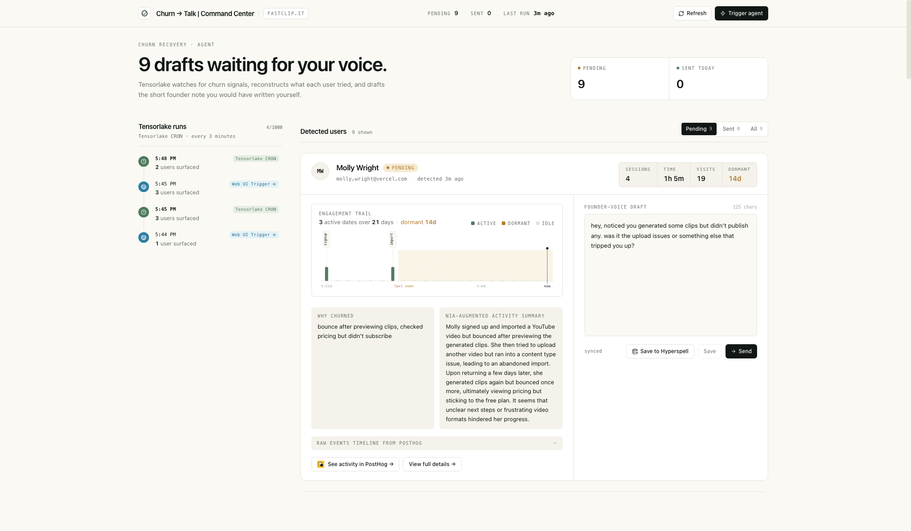

# Churn to Talk

Churn to Talk is an agent that continuously finds churned users who were interested in your product and helps founders talk to them with personalized recovery emails.



## Why

> "Half the advice I give to startups is some form of 'talk to your customers.'" — Paul Graham

Founders know they should follow up with churned users, but doing it every day means digging through event logs, reconstructing what each person tried, understanding where they got stuck, and writing a non-generic message. Churn to Talk does that work automatically so the founder only has to review and send.

## How It Works

- **Tensorlake** runs the churn recovery agent on a 3-minute cron, with a manual trigger for demos.
- **PostHog-style event timelines** identify users who showed intent and then dropped off.
- **Nia** adds codebase and product workflow context so raw events become a likely churn reason.
- **OpenAI** drafts short, founder-style recovery emails for each user.
- **InsForge Postgres** stores detected users, run history, drafts, and state.
- **Hyperspell** stores recurring churn patterns and product issues as memory.
- **Next.js on Vercel** gives the founder a command center to review, edit, save, and send.

## Environment

Copy `.env.example` to `.env` and fill in:

```bash
OPENAI_API_KEY=
NIA_API_KEY=
FASTCLIP_REPO_URL=https://github.com/quasa0/fastclip.it-copy
NIA_REPOSITORY=quasa0/fastclip.it-copy
NIA_CONTEXT_QUERY=fastclip.it-copy context churn recovery
NIA_LOCAL_FOLDER=fastclip.it-copy
NIA_LOCAL_FOLDER_ID=
SKIP_NIA=0
INSFORGE_DATABASE_URL=
TENSORLAKE_API_KEY=
TENSORLAKE_AGENT_URL=https://api.tensorlake.ai/applications/churn_recovery_agent
TENSORLAKE_APPLICATION_NAME=churn_recovery_agent
```

## Local Setup

```bash
npm install
npm run setup:db
npm run dev
```

Open `http://localhost:3000`.

## Tensorlake

Set secrets:

```bash
tl secrets set OPENAI_API_KEY=$OPENAI_API_KEY \
  NIA_API_KEY=$NIA_API_KEY \
  INSFORGE_DATABASE_URL=$INSFORGE_DATABASE_URL
```

Deploy and trigger:

```bash
npm run deploy:tensorlake
npm run trigger:agent
```

Create the 3-minute cron:

```bash
npm run deploy:tensorlake:cron
```

Tensorlake exposes the manual trigger endpoint at:

```text
https://api.tensorlake.ai/applications/churn_recovery_agent
```

## Nia

Index or refresh the fastclip repo/source context:

```bash
npm run index:nia
```

For this hackathon setup, a permanent Nia shared context exists under the title `fastclip.it-copy context for churn recovery agent`. Set `SKIP_NIA=0` and deploy with `NIA_CONTEXT_QUERY=fastclip.it-copy context churn recovery`.

## Vercel

Set these Vercel environment variables:

```bash
INSFORGE_DATABASE_URL
TENSORLAKE_AGENT_URL
TENSORLAKE_API_KEY
```

Deploy:

```bash
npm run deploy:vercel
```
